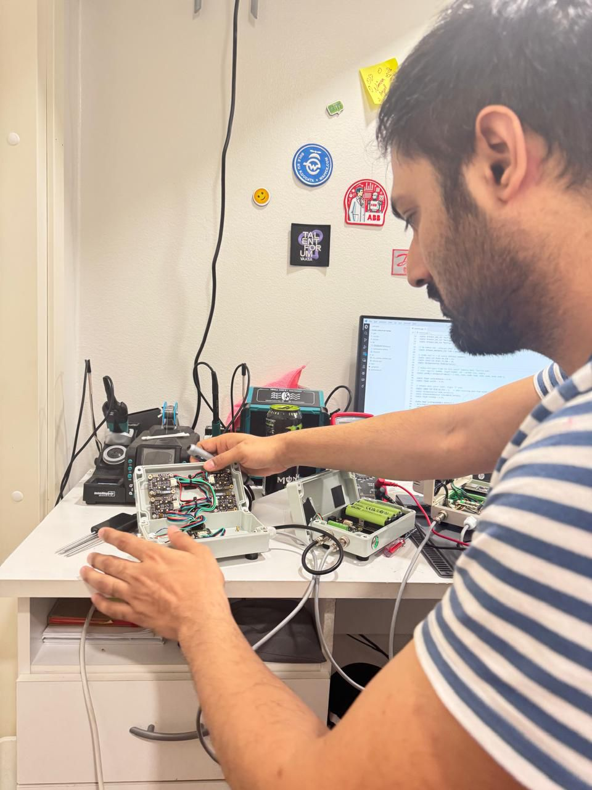
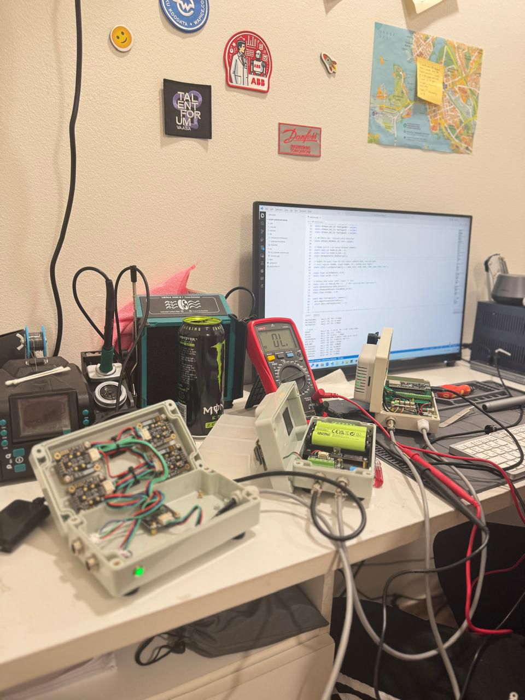
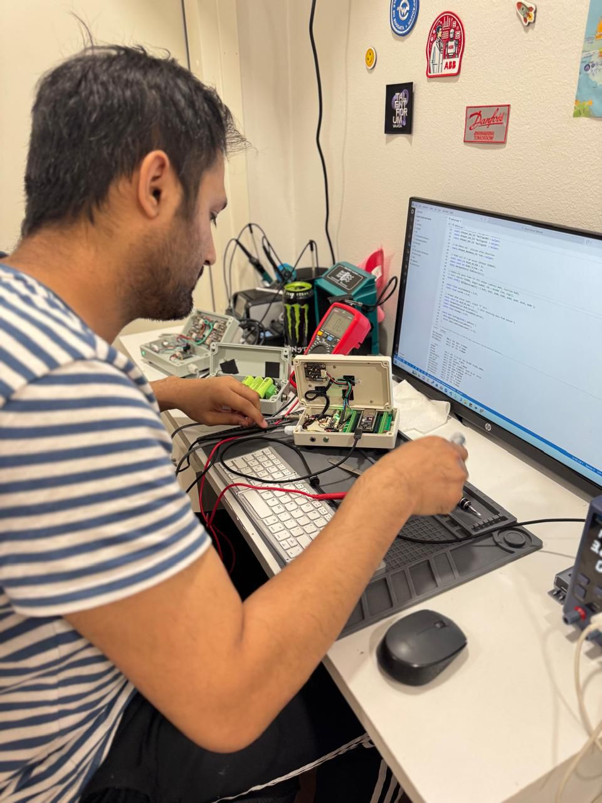

# :seedling: Plant Monitoring Sensor Network -- Complete IoT System


A production-ready full-stack IoT environmental monitoring system with **13 sensors**, battery + solar power, deep-sleep optimization achieving **~92% power savings**, and a real-time web dashboard. The system wakes every 30 minutes, reads all sensors, transmits data over Wi-Fi, and goes back to sleep -- designed to run **indefinitely on solar power**.

> **This is the firmware repository.** See also: [Backend API](https://github.com/zaeem7744/Plant-Sensor-Network-Backend) | [Web Dashboard](https://github.com/zaeem7744/Plant-Sensor-Network-Web-Dashboard)

---

## :camera: Screenshots

### Overview Dashboard -- System Status & 24h Averages
Shows total sensors, online/offline count, 1,786+ measurements recorded, and live sensor cards with real-time readings.


### All Sensors View -- Live Readings Grid
13 environmental sensors displayed with real-time values, status indicators (green = online), and "View details" drill-down.


### Sensor Detail -- Historical Charts & Statistics
Individual sensor view with configurable time range (24h / 7d / 30d / All), interactive time-series chart, and min/max/avg statistics.


### Gas Sensors -- Category Filter
Filter sensors by category: Environment, Light, Gas, Soil. Showing 8 gas sensors monitoring CO, CH4, NH3, H2S, HCHO, O2, O3, and Alcohol.


### Backend API -- FastAPI + Uvicorn Running


### Hardware Development -- Firmware & Sensor Testing


### Lab Setup -- Oscilloscope, Multimeter & Sensor Node Enclosures


### Hardware Debugging -- Probing Sensor Nodes


---

## :zap: Key Highlights

- **13 Environmental Sensors** with I2C multiplexing (2x TCA9548A) for address conflict resolution
- **~92% power savings** via deep sleep + MOSFET-switched sensor power rail
- **Solar-powered indefinite runtime** -- 10W panel generates 4.3x daily consumption
- **Battery backup** -- 3x 18650 cells (8,700 mAh), 5+ days without sunlight
- **Dual measurement cycle** -- status check then data upload for reliability
- **Production-ready dashboard** with real-time updates, historical charts, and statistics
- **Full-stack architecture** -- ESP32-S3 firmware + FastAPI backend + React/TypeScript frontend

---

## :building_construction: System Architecture

```
10W Solar Panel --> Charge Controller --> 3x 18650 Battery (8700 mAh)
                                              |
                                        Boost Converter (3.7V --> 5V)
                                              |
                    +-------------------------+-------------------------+
                    |                                                   |
              ESP32-S3 MCU                                   N-Channel MOSFET (GPIO 14)
         (always powered, ~20mA sleep)                              |
                    |                                        Sensor 5V Rail
                    |                                              |
              +-----+-----+                              All 13 Sensors (~300mA active)
              |           |
         Timer Wake   Button Wake -----> Double Measurement Cycle
         (30 min)     (GPIO 7)                    |
                                           WiFi POST --> FastAPI Backend --> SQLite DB
                                                                |
                                                    React Dashboard (live updates)
```

### Power States

| State | Current Draw | Duration | Description |
|-------|-------------|----------|-------------|
| **Active** | ~300 mA | ~8 sec | Sensors ON, reading + WiFi transmit |
| **Deep Sleep** | ~26 mA | ~1792 sec | ESP32 sleep + sensors OFF via MOSFET |
| **Average per cycle** | -- | 30 min | 13.62 mAh per cycle |
| **Daily consumption** | -- | 24h | ~653 mAh @ 5V (~3.27 Wh) |
| **Solar generation** | -- | 5h sun | ~2,800 mAh/day (4.3x surplus) |

---

## :satellite: Sensor Network

The system uses **two TCA9548A I2C multiplexers** to avoid address conflicts across 13 sensors:

| Sensor | Parameter(s) | Protocol | I2C Mux |
|--------|-------------|----------|---------|
| MS8607 | Temperature, Humidity, Pressure | I2C | MUX_A (0x70) |
| BH1750 | Light Intensity (lux) | I2C | MUX_A |
| MLX90614 | IR Object Temperature | I2C | MUX_B (0x71) |
| Soil Moisture | Capacitive Moisture | I2C | MUX_B |
| Alcohol (MQ-135) | Alcohol concentration (ppm) | I2C/Analog | MUX_A |
| CH4 (MHZ9041A) | Methane (LEL) | I2C | MUX_A |
| Soil EC + pH | Conductivity, pH | UART2 (RS485) | -- |
| HCHO | Formaldehyde (ppm) | UART1 | -- |
| H2S | Hydrogen Sulfide (ppm) | I2C | MUX_A |
| O2 | Oxygen (%vol) | I2C | MUX_B |
| NH3 | Ammonia (ppm) | I2C | MUX_B |
| CO | Carbon Monoxide (ppm) | I2C | MUX_B |
| O3 | Ozone (ppm) | I2C | MUX_B |

### Hardware Connections

- **I2C Bus**: SDA = GPIO 8, SCL = GPIO 9
- **Sensor Power**: 5V rail controlled by N-Channel MOSFET (GPIO 14)
- **UART2 (Soil EC+pH)**: RX = GPIO 19, TX = GPIO 20 (RS485)
- **UART1 (HCHO)**: RX = GPIO 5
- **Wake Button**: GPIO 7 (internal pull-up)
- **Status LED**: Blue LED on GPIO 21

---

## :gear: Firmware Behavior

### Measurement Cycle (Dual-Cycle Approach)

Each wake-up performs **two measurement cycles** for reliability:

1. **Cycle 1 -- Status Check**: Power ON sensors --> Read all values --> Serial output --> Power OFF (no upload)
2. **Cycle 2 -- Data Upload**: Power ON sensors --> Read all values --> **POST to backend** --> Power OFF
3. **Deep Sleep**: Enter deep sleep for 30 minutes (wake on timer or button)

### JSON Payload Example

```json
{
  "ts_ms": 1234567,
  "MS8607": { "status": "online", "T": 24.3, "RH": 60.5, "P": 1013.2 },
  "BH1750": { "status": "online", "lux": 185.0 },
  "MULTIGAS": {
    "H2S": { "status": "online", "value": 0.0, "unit": "ppm" },
    "O2":  { "status": "online", "value": 20.9, "unit": "%vol" },
    "CO":  { "status": "online", "value": 0.0, "unit": "ppm" }
  },
  "summary": { "sensor_total": 13, "offline_count": 0 }
}
```

### Configurable Parameters

```cpp
SENSOR_SAMPLE_INTERVAL_MS = 1800000  // 30 min between wake cycles
SENSOR_POWER_WARMUP_MS    = 3000     // 3 sec sensor stabilization
SENSOR_MOSFET_PIN         = 14       // GPIO controlling sensor power
WAKE_BUTTON_PIN           = 7        // Manual wake-up button
STATUS_LED_PIN            = 21       // Blue status LED
```

### LED Status Indicators

- **Solid ON**: Device awake, WiFi connected
- **Rapid blink (5x)**: WiFi connection failed
- **Slow blink (1Hz)**: Awake but WiFi offline (button wake mode)
- **OFF**: Deep sleep

---

## :file_folder: Project Structure

```
Plant-Sensor-Network/
|-- Firmware/
|   +-- Plant Sensor Network/
|       |-- src/
|       |   |-- sensors.cpp          # Main sensor reading + WiFi logic
|       |   |-- config.h             # WiFi credentials + backend URL
|       |   +-- DFRobotHCHOSensor.h  # HCHO sensor library
|       +-- platformio.ini           # PlatformIO configuration
|-- Schemetic/                       # Circuit schematics and PCB files
|-- Images/                          # Dashboard and system screenshots
|-- Documents/                       # BOM, technical documentation
+-- Requirements/                    # System specifications
```

---

## :rocket: Quick Start

### 1. Configure Firmware
Edit `src/config.h`:
```cpp
#define WIFI_SSID     "YourWiFiNetwork"
#define WIFI_PASSWORD "YourPassword"
#define BACKEND_URL   "http://YOUR_PC_IP:8000/api/ingest"
```
Upload to ESP32-S3 via PlatformIO.

### 2. Start Backend
```bash
cd Plant-Sensor-Network-Backend
pip install -r requirements.txt
python -m uvicorn main:app --reload --host 0.0.0.0 --port 8000
```

### 3. Start Dashboard
```bash
cd Plant-Sensor-Network-Web-Dashboard
npm install
# Configure .env: VITE_BACKEND_URL=http://YOUR_PC_IP:8000
npm run dev
```

### 4. Power On ESP32
Device will: Connect to WiFi --> Measure --> Upload --> Deep sleep (30 min) --> Repeat

---

## :hammer_and_wrench: Tech Stack

| Component | Technology |
|-----------|-----------|
| **MCU** | ESP32-S3 |
| **Firmware** | C/C++ (PlatformIO) |
| **Backend** | [FastAPI + SQLite](https://github.com/zaeem7744/Plant-Sensor-Network-Backend) |
| **Frontend** | [React + TypeScript + Tailwind CSS](https://github.com/zaeem7744/Plant-Sensor-Network-Web-Dashboard) |
| **Protocols** | I2C, UART, RS485, Wi-Fi, HTTP REST |
| **Power** | 10W Solar + 3x 18650 batteries + MOSFET switching |
| **PCB Tools** | Schematic design files included |

---

## :bust_in_silhouette: Author

**Muhammad Zaeem Sarfraz** -- Electronics & IoT Hardware Engineer

- :link: [LinkedIn](https://www.linkedin.com/in/zaeemsarfraz7744/)
- :email: Zaeem.7744@gmail.com
- :earth_africa: Vaasa, Finland

---

*Document Version: 1.0 | Status: Production Ready | Last Updated: February 2026*
